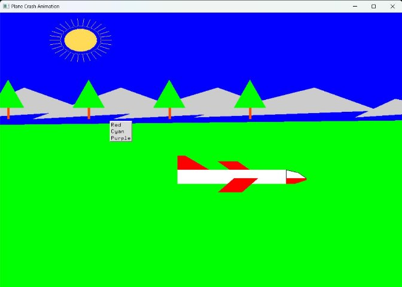
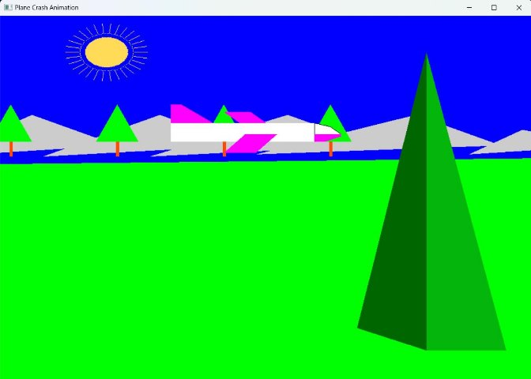
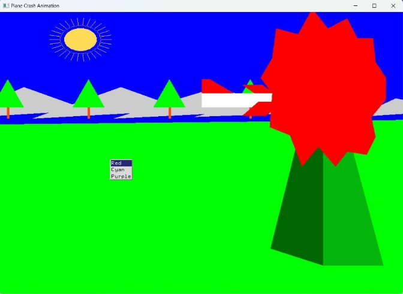

# Aeroplane-crash-Computer-Graphics-OpenGL

**Computer Graphics (UCS505)  Project on** 

**Aeroplane Crash** 

**Computer Science and Engineering Department Thapar Institute of Engineering and Technology Patiala – 147001** 

**Table of Contents** 

|**Sr. No.** |**Description** |
| - | - | 
|1\. |Introduction to Project |
|2\. |Computer Graphics concepts used |
|3\. |User Defined Functions |
|4\. |Code |
|5\. |Output/ Screen shots |

**INTRODUCTION TO PROJECT**  

In the project,  Aeroplane Crash Animation, created using OpenGL utilizes  the power of computer graphics to recreate a realistic and dynamic simulation of an aeroplane crash. Using OpenGL, a powerful graphics library, the details of an aeroplane crash are bought to life , including the flight dynamics, physics, and visual effects.  

The project showcases the realistic rendering of aeroplane model , and environmental elements, such as the sun and its rays, hills, trees, river and mountain. For the animation to feel real, the focus  is  given  on  the  two  essential  elements  that  the  animation  needs  to  get  right  are  the “Aeroplane” and the “Mountain”. We made the project to show the best that we have learned. The main objectives of the project are: 

1. Make it user friendly 
1. To provide an easy interface (menu driven: to change to aeroplane colour). 
1. To entertain people in the leisure time. 

**COMPUTER GRAPHICS CONCEPT USED** 

1. **Graphics Primitives:** The code uses various graphics primitives like points, circles, and polygons to draw graphical elements on the screen. 
1. **Coordinate System:** The code uses a Cartesian coordinate system to specify the positions of points, circles, and polygons on the screen. It uses functions like glVertex2f() to specify the coordinates of points and vertices of polygons. 
3. **Color:** The code uses color functions like glColor3f() to specify the RGB values of colors for drawing graphical elements with different colors. 
4. **Callback  Functions:**  The  code  uses  callback  functions  like  glutDisplayFunc(), glutMouseFunc(), and glutTimerFunc() to handle various events like display, keyboard input, mouse input, and timer events respectively.
5. **Circle Drawing Algorithm**: It uses Bresenham's circle drawing algorithm and midpoint circle drawing algorithm to draw circles, which involve drawing lines between points on the circumference of the circle. 
6. **Transformation:** It updates the positions of graphical elements like the plane using the update() function, which involves changing the values of global variables representing the positions. 
7. **Rendering  Pipeline:**  It  uses  the  OpenGL  rendering  pipeline  to  perform  rendering operations like clearing the screen, specifying the color of graphical elements, and drawing graphical elements on the screen. 
8. **Animation:** It uses the glutTimerFunc() function to create animation effects by repeatedly calling the update() function to update the positions of graphical elements and redraw the screen, creating a sense of animation. 
9. **Basic Drawing Operations**: It uses basic drawing operations like drawing points, circles, and polygons using OpenGL functions like glBegin(), glEnd(), and glVertex2f() to create graphical elements on the screen.
10. The **glPushMatrix() and glPopMatrix()** functions are used in the given code, which are part of the transformation stack in OpenGL. These functions allow for saving and restoring the current transformation state, which can be useful when applying transformations to graphical elements 

**USER DEFINED FUNCTIONS** 

1. **myinit() -** This function initializes light source for ambient, diffuse and specular types.** 
1. **color(int id) –** This function is used as a callback function to change the color of the aeroplane based on the ‘id’ selected by from the menu, and changes it to ‘red’, ‘green’, ‘purple’ respectively.** 
1. **display():** This is the main display function that is called by GLUT to redraw the window. It clears the screen using glClear() function, and then calls various functions to draw graphical elements like circles, sun rays, and mountains 
1. **main():** The execution of the program starts from this function. It initializes the graphics system and includes many callback functions. 
1. **update() –** This function is used as a timer callback function  to update the position of the aeroplane by changing the global variables ‘a’ and ‘c’ which represent the plane’s position on  x  and  y  axis.  It  is  called  repeatedly  with  a  delay  of  150  milliseconds  using glutTimerFunc() function. The updated positions are used to redraw the plane's position using glutPostRedisplay() function. 
1. **plot(int x, int y) –** This function is used to draw a point at the specified coordinates (x, y). It uses glBegin(GL\_POINTS) and glVertex2f() functions to draw a single point. 
1. **hill() –** This function is meant to draw a big mountain responsible for the plane crash. 
1. **mountain() –** This function is meant to display mountains in the background scenery. 
1. **trees() –** This function displays trees along the mountains in the background 
1. **bresenham\_circle(int  r)  -**  This  function  implements  the  Bresenham's  circle  drawing algorithm to draw a circle with radius r using points. It calculates the points on the circumference of the circle using Bresenham's algorithm and calls plot() function to draw the points. 
1. **midPointCircleAlgo(int  r)  -**  This  function  implements  the  midpoint  circle  drawing algorithm to draw a circle with radius r using points. It calculates the points on the circumference of the circle using the midpoint algorithm and calls plot() function to draw the points. 
12. **fillCircle(int xc, int yc, int radius) -** This function is used to draw a filled circle with center coordinates (xc, yc) and radius ‘radius’ using OpenGL's GL\_TRIANGLE\_FAN primitive. It calculates the coordinates of points on the circumference of the circle using trigonometric functions and calls glVertex2f() function to draw the points. 
12. **drawSunRays(int xc, int yc, int numRays, int rayLength) –** This function is used to draw sun rays originating from a center point (xc, yc) with a specified number of rays numRays and length of rays rayLength. 
12. **blast() –** This function is meant to depict a blast or explosion effect. 
12. **display2() –** This function is an additional display function to show the aeroplane crash scene** 
 

**OUTPUT/ SCREENSHOTS** 

